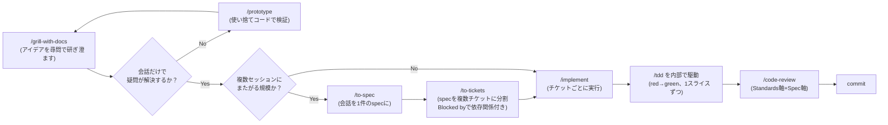

# mattpocockスキルの正しい使い方

## 情報源について

本ドキュメントは公式リポジトリ [github.com/mattpocock/skills](https://github.com/mattpocock/skills) の内容を唯一の情報源として書いている（確認時点のmainブランチ、コミット`6654f6b`）。

このプロジェクトにインストール済みのプラグイン本体（`~/.claude/plugins/marketplaces/mattpocock/`）はバージョン`1.2.0`（コミット`2ab9580`、2026-07-28時点）に固定されており、GitHub上のmainは`1.2.3`まで進んでいる。両者を`git diff`で突き合わせたところ、差分は文言の言い回し（`—`を`:`や`,`に置き換えるなど）と、`wizard`・`to-questionnaire`・`wait-what`という新規スキルの追加のみで、以降で説明する`to-spec`・`to-tickets`・`implement`・`grill-with-docs`の挙動やUser-invoked/Model-invokedの仕組み自体に実質的な変更はなかった。迷ったら`~/.claude/plugins/marketplaces/mattpocock`で`git fetch origin main`して`git diff <ローカルHEAD> origin/main`を取れば、インストール版と最新版の差分を常に確認できる。

## 全体設計：User-invoked と Model-invoked

すべてのスキルは「誰が呼び出せるか」で2種類に分かれる（[Explanation/0002](0002-mattpocockスキルのUser-invokedとModel-invoked.md)で詳説）。

- **User-invoked**: 人間が`/スキル名`と明示的にタイプしたときだけ呼ばれる。複数スキルをまたいで進行を制御する「オーケストレーション役」。
- **Model-invoked**: タスクの内容と合致すれば、私（エージェント）が自律的に呼んでもよい。「再利用可能な規律・道具」役。

公式README（`Reference`節）に載っている正式な一覧は以下の通り（Engineeringカテゴリのみ抜粋、Productivityは省略）。

| 分類 | スキル |
|---|---|
| User-invoked | `ask-matt`, `grill-with-docs`, `triage`, `improve-codebase-architecture`, `setup-matt-pocock-skills`, `to-spec`, `to-tickets`, `implement`, `wayfinder` |
| Model-invoked | `prototype`, `diagnosing-bugs`, `research`, `tdd`, `domain-modeling`, `codebase-design`, `code-review`, `resolving-merge-conflicts`, `wizard`（最新版で追加） |

## 事前準備：`/setup-matt-pocock-skills`

他のengineering系スキルを初めて使う前に、リポジトリごとに一度だけ実行する。issue tracker（GitHub / GitLab / ローカルMarkdown）・トリアージラベルの語彙・ドメインドキュメントの置き場所を対話的に決めて書き出す。

このプロジェクトでは[docs/agents/issue-tracker.md](../docs/agents/issue-tracker.md)（GitHub Issuesを採用）・[docs/agents/triage-labels.md](../docs/agents/triage-labels.md)・[docs/agents/domain.md](../docs/agents/domain.md)がその成果物で、公式テンプレート`issue-tracker-github.md`をそのまま採用した内容になっている。

## メインフロー：アイデアから実装まで

`ask-matt`スキル（「どのスキルを使えばいいか迷ったときのルーター」）のドキュメントに、公式の一本道として明記されている流れ。



1. **`/grill-with-docs`** — 作業ディレクトリがある場合の出発点。尋問形式でアイデアを研ぎ澄まし、学んだことを`CONTEXT.md`とADRに記録し続ける（作業ディレクトリが無ければ同じ尋問処理だが記録を残さない`/grill-me`を使う）。
2. **疑問が会話だけで解決しない場合**（状態設計やUIを実際に動かしてみないと判断できない）は、`/handoff`で別セッションに切り出し、`/prototype`で使い捨てコードを書いて検証し、`/handoff`で知見を持ち帰ってから合流する。
3. **複数セッションにまたがる規模のビルドか？**
   - **Yes** → `/to-spec`で会話を1件のspecにまとめて発行し、`/to-tickets`でそのspecを縦切り（vertical slice）の複数チケットに分割・発行する。各チケットは「blocking edges（自分をブロックする他チケット）」を持つ。ローカルトラッカーなら`.scratch/<feature>/issues/`配下に1チケット1ファイル、GitHubのような実トラッカーならissueのネイティブなブロック関係になる。ブロッカーが片付いたチケット（＝frontier）から`/implement`を回し、1チケット終えるごとに`/clear`でコンテキストをリセットする。
   - **No**（単一セッションで完結する規模）→ その場で`/implement`。
4. どちらの経路でも**`/implement`**が実装の実行役で、内部で**`/tdd`**を1スライスずつ（red→green）駆動し、typecheckとテストを回し、最後に**`/code-review`**（Standards軸＋Spec軸の2軸レビュー）をかけてからコミットする。

**コンテキスト管理の注意（公式ドキュメントより）**: ステップ1〜3（grilling→spec→tickets）は同じコンテキストウィンドウ内で連続して行い、`/to-tickets`が終わるまで`/compact`や`/clear`をしない。各`/implement`はチケットごとに新しいセッションで始める。

## `/to-spec`と`/to-tickets`の違い

| | `/to-spec` | `/to-tickets` |
|---|---|---|
| 入力 | 会話（合成のみ、追加インタビューなし） | spec / プラン / 会話 |
| 出力 | **1件**のissue（要件をまとめた仕様書） | **複数件**のissue（実装可能な縦切り単位） |
| 依存関係 | なし | `Blocked by`で明示（GitHubなら[ネイティブissue依存機能](#issueのネイティブ依存関係github)） |
| ユーザーへの確認 | なし（合成のみ） | あり（粒度と依存関係を提示して承認を得てから発行） |

### このプロジェクトでの実例

`gh issue view`で実際のissue本文を取得すると、両スキルの出力そのものが残っていた。

- **issue #1**（「整備記録の登録・閲覧・編集・削除機能」）の本文は`to-spec`の`<spec-template>`（Problem Statement / Solution / User Stories / Implementation Decisions / Testing Decisions / Out of Scope / Further Notes）と一字一句同じ構成。
- **issue #3**（「サインアップ・ログイン・ログアウト」）の本文は`to-tickets`の`<issue-template>`（`## Parent` / `## What to build` / `## Acceptance criteria` / `## Blocked by`）と一致しており、`## Parent`に`#1`を、`## Blocked by`に`#2`を参照している。

つまりこのリポジトリでは実際に`/to-spec`（#1発行）→`/to-tickets`（#1を分割して#2〜#6発行）という公式の順序通りに作業が進められていた。

## issueのネイティブ依存関係（GitHub）

`to-tickets`が発行するチケットの`Blocked by`は、issue本文に文章で書くだけの慣習ではなく、GitHub側が構造化データとして持つ**Issue Dependencies**機能を使う（`setup-matt-pocock-skills`の`issue-tracker-github.md`より）。

```sh
gh api --method POST repos/<owner>/<repo>/issues/<child>/dependencies/blocked_by \
  -F issue_id=<blocker-db-id>
```

`<blocker-db-id>`はissueの`#番号`ではなく数値のdatabase id（`gh api repos/<owner>/<repo>/issues/<n> --jq .id`で取得）である点に注意。`gh issue view`のJSON出力に`issue_dependencies_summary.blocked_by`（未クローズのブロッカー数）として現れ、ブロッカーがcloseされるとこのカウントが自動的に減る。0になった時点で着手可能（＝frontier）になる。

実際、issue #3の本文には`Blocked by: #2（プロジェクト基盤のセットアップ）`とあったが、#2は既にCLOSE済みのため#3は現時点でブロック解除されている。

## このプロジェクトの現在地

親issue #1（整備記録CRUD機能、`/to-spec`の成果物）の下に、`/to-tickets`が分割した子issueが並んでいる。

1. #2 プロジェクト基盤 → CLOSED
2. #3 認証（サインアップ/ログイン/ログアウト） → 着手可能（ブロッカー#2がCLOSE済み）
3. #4 整備記録の登録・一覧閲覧 → #3待ち
4. #5 整備記録の編集・削除 → #4待ち
5. #6 整備種別ごとのサマリービュー → #4待ち

認証を最初に作るのは、以降のすべてのエンドポイント（整備記録CRUD）が「ログイン済みユーザーのデータだけを扱う」という前提に立つため。

## 正しい使い方チェックリスト（フェーズ別）

- **まだ何もない、アイデア段階** → `/grill-with-docs`
- **会話はまとまったがissueがまだ無い** → `/to-spec`
- **specはあるがチケット化されていない** → `/to-tickets`
- **チケットがある、次にどれから着手すべきか迷う** → ブロッカーが0件のissue（frontier）を確認
- **着手するチケットが決まった** → `/implement`（内部で`/tdd`→`/code-review`→commitを自動で回す）
- **バグ報告や割り込みリクエストが飛び込んできた** → `/triage`で仕分けてから`/implement`
- **原因不明の不具合・性能劣化** → `/diagnosing-bugs`
- **1セッションを超える巨大で見通しの立たないタスク** → `/wayfinder`

このプロジェクトは既にissueが発行・分割済みの「実装フェーズ」にあるため、フローの前半（`grill-with-docs`〜`to-tickets`、ゼロから発想してissueを起こす工程）を使う出番は今のところなく、`/implement`相当（実質的には`tdd`→`code-review`）を各issueに対して回していく段階にある。
