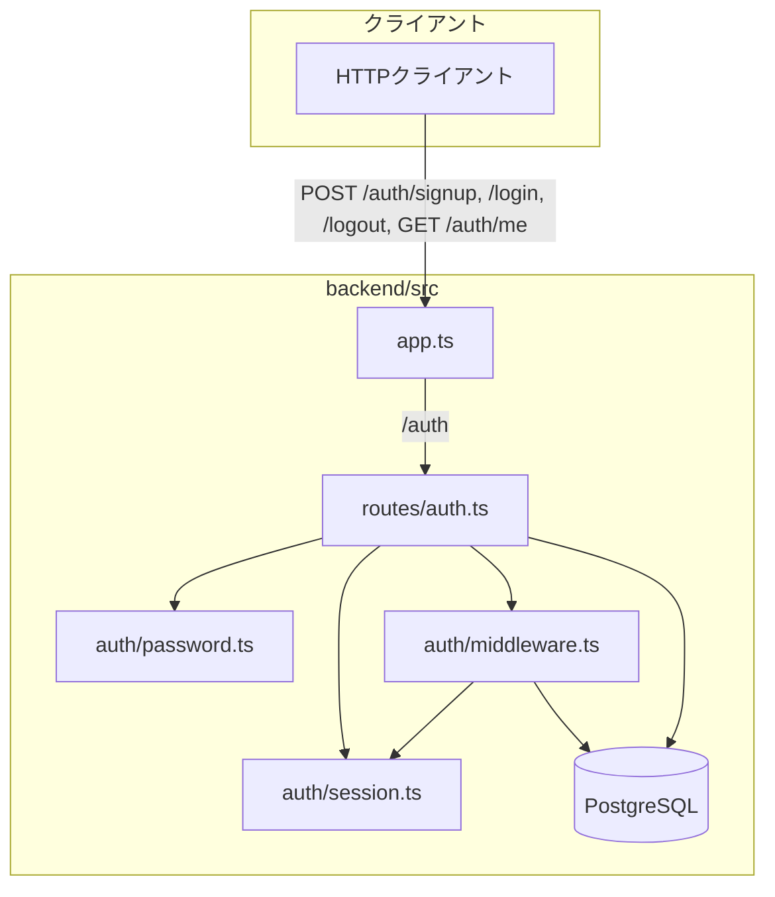

# issue #3（認証機能）の実装詳細

issue #3「サインアップ・ログイン・ログアウト」（commit `45bf7ad`）で追加・変更した全ファイルを、コードを省略せずに解説する。全体像は「Node.js組み込みの`crypto`だけでパスワードハッシュとセッショントークンを自前実装し、PostgreSQLの`sessions`テーブルでログイン状態を管理する」という構成。新規npmパッケージは1つも追加していない。

## 全体アーキテクチャ



- `password.ts`: パスワードのハッシュ化・検証（DBにもネットワークにも依存しない純粋関数）
- `session.ts`: セッショントークンの生成と、リクエストヘッダからの抽出（同じく純粋関数中心）
- `middleware.ts`: `password.ts`/`session.ts`を使わず`session.ts`の`extractBearerToken`とDBを使って「このリクエストは誰か」を判定するExpressミドルウェア
- `routes/auth.ts`: 上記3つを組み合わせて4本のHTTPエンドポイントを定義する層

## 1. マイグレーション: `backend/migrations/1787647367781_create-users-and-sessions.js`

```js
export const shorthands = undefined;

export const up = (pgm) => {
  pgm.createTable('users', {
    id: 'id',
    email: {
      type: 'text',
      notNull: true,
      unique: true,
    },
    password_hash: {
      type: 'text',
      notNull: true,
    },
    created_at: {
      type: 'timestamptz',
      notNull: true,
      default: pgm.func('now()'),
    },
  });

  pgm.createTable('sessions', {
    token: {
      type: 'text',
      primaryKey: true,
    },
    user_id: {
      type: 'integer',
      notNull: true,
      references: 'users',
      onDelete: 'CASCADE',
    },
    created_at: {
      type: 'timestamptz',
      notNull: true,
      default: pgm.func('now()'),
    },
  });
};

export const down = (pgm) => {
  pgm.dropTable('sessions');
  pgm.dropTable('users');
};
```

`node-pg-migrate`の`pgm`（MigrationBuilder）のメソッド呼び出しを積み上げてSQLのDDLを組み立てる仕組み（[0004](0004-PostgreSQLとマイグレーションの仕組み.md)参照）。

- **`users`テーブル**: `id: 'id'`はnode-pg-migrateのショートハンドで、`serial PRIMARY KEY`に展開される。`email`は`unique: true`でDBレベルの一意制約を持つ（アプリ側で重複チェックをしていても、同時リクエストによる競合はこの制約が最終的な砦になる）。`password_hash`には平文パスワードではなく、`password.ts`が生成したハッシュ文字列を保存する。
- **`sessions`テーブル**: セッショントークンそのものを`token`列の主キーにしている（別途連番の`id`は持たない。トークン文字列自体が一意で衝突しないランダム値なので、そのまま主キーにできる）。`user_id`は`references: 'users'`で外部キー制約を張り、`onDelete: 'CASCADE'`によって「ユーザーが削除されたら、そのユーザーのセッションも自動的に全部消える」という整合性をDB側で保証している。
- **`down`**: `up`の逆順（`sessions`→`users`）でテーブルを削除する。`sessions`が`users`を外部キー参照しているため、先に`users`を消そうとすると外部キー制約違反になる。

## 2. パスワードハッシュ: `backend/src/auth/password.ts`

```ts
import { randomBytes, scrypt as scryptCallback, timingSafeEqual } from 'node:crypto';
import { promisify } from 'node:util';

const scrypt = promisify(scryptCallback);
const KEY_LENGTH = 64;

export async function hashPassword(password: string): Promise<string> {
  const salt = randomBytes(16).toString('hex');
  const derivedKey = (await scrypt(password, salt, KEY_LENGTH)) as Buffer;
  return `${salt}:${derivedKey.toString('hex')}`;
}

export async function verifyPassword(password: string, storedHash: string): Promise<boolean> {
  const [salt, hashHex] = storedHash.split(':');
  const storedKey = Buffer.from(hashHex, 'hex');
  const derivedKey = (await scrypt(password, salt, KEY_LENGTH)) as Buffer;
  return storedKey.length === derivedKey.length && timingSafeEqual(storedKey, derivedKey);
}
```

パスワードを平文でDBに保存すると、DBが漏洩した瞬間に全ユーザーのパスワードが漏れる。そのため「元のパスワードには戻せないが、同じパスワードなら同じ値になる」変換（ハッシュ化）をしてから保存する。ここではbcryptなどの外部ライブラリを追加せず、Node.js組み込みの`crypto.scrypt`を使っている。

- **`scrypt`**: 意図的に計算コスト（CPU・メモリ）が高いハッシュ関数。総当たり攻撃（ハッシュ値から元のパスワードを推測する試行を大量に繰り返す攻撃）のコストを引き上げるのが目的。`crypto.scrypt`はコールバック形式のAPIなので、`promisify`で`await`できる関数に変換している。
- **`salt`**（`randomBytes(16).toString('hex')`）: ユーザーごとに異なるランダムな16バイト値。同じパスワードを使う2人のユーザーがいても、saltが違えば`password_hash`の値は別物になる。これにより「よくあるパスワードのハッシュ値を事前に大量計算しておく」レインボーテーブル攻撃を無効化する。
- **保存形式**: `${salt}:${derivedKey.toString('hex')}`という`salt:hash`のコロン区切り文字列1本にまとめて`password_hash`列に保存する。検証時は`storedHash.split(':')`で分解し、同じsaltを使って入力パスワードを再度ハッシュ化し、結果を比較する。
- **`timingSafeEqual`**: 文字列の`===`比較ではなく、これを使っている。通常の比較は先頭バイトから順に見て不一致が見つかった時点で処理を打ち切るため、不一致が起きた位置によって処理時間にわずかな差が生まれる。攻撃者がこの時間差を測定して1バイトずつハッシュ値を推測する「タイミング攻撃」を防ぐため、`timingSafeEqual`は必ず全バイトを比較してから結果を返す。

## 3. セッショントークン: `backend/src/auth/session.ts`

```ts
import { randomBytes } from 'node:crypto';
import type { Request } from 'express';

const BEARER_PREFIX = 'Bearer ';

export function generateSessionToken(): string {
  return randomBytes(32).toString('hex');
}

export function extractBearerToken(req: Request): string | undefined {
  const header = req.header('Authorization');
  return header?.startsWith(BEARER_PREFIX) ? header.slice(BEARER_PREFIX.length) : undefined;
}
```

- **`generateSessionToken`**: `randomBytes(32)`で32バイト（256ビット）の暗号学的に安全な乱数を生成し、16進文字列（64文字）にする。これがログイン中であることを示す「合言葉」になる。JWTのような自己完結型トークン（中に有効期限やユーザーIDなどの情報を署名付きで埋め込む方式）ではなく、ただのランダム文字列を発行し、DBの`sessions`テーブルに「このトークン文字列＝このユーザー」という対応を記録する方式（＝不透明トークン、opaque token）を選んでいる。これにより、ログアウト時に「このトークンをもう無効にする」という操作がDBの行削除だけで確実にでき、JWTのように「発行済みトークンをどう失効させるか」という別の仕組みを考える必要がない。
- **`extractBearerToken`**: HTTPの`Authorization`ヘッダーは`Authorization: Bearer <トークン文字列>`という形式で送られてくる（`Bearer`はOAuth 2.0由来の慣習的なスキーム名）。`Bearer `というprefixを取り除いて中身のトークン文字列だけを返す。ヘッダーが無い、または`Bearer `で始まっていなければ`undefined`を返す。
- この関数は`middleware.ts`と`routes/auth.ts`のlogoutハンドラの両方から使われている（後述）。

## 4. Expressの型拡張: `backend/src/auth/express.d.ts`

```ts
import 'express';

declare module 'express-serve-static-core' {
  interface Request {
    user?: { id: number; email: string };
  }
}
```

Expressの`Request`型には標準で`user`プロパティは存在しない。しかし後述の`requireAuth`ミドルウェアは、認証に成功したら`req.user = { id, email }`という形でリクエストオブジェクトに現在のユーザー情報を書き込み、後続のハンドラ（`GET /auth/me`など）がそれを読み取れるようにしたい。TypeScriptの[宣言のマージ（declaration merging）](https://www.typescriptlang.org/docs/handbook/declaration-merging.html)という機能を使い、`express-serve-static-core`モジュール（Expressの型定義が実際に依存している内部モジュール）の`Request`インターフェースに`user?`フィールドを追加している。これにより`req.user`への代入・参照がプロジェクト全体で型エラーにならず、かつ`user`が`undefined`かもしれないことも型として表現される（未認証のリクエストでは`req.user`は存在しない）。

## 5. 認証ミドルウェア: `backend/src/auth/middleware.ts`

```ts
import type { NextFunction, Request, Response } from 'express';
import { pool } from '../db.js';
import { extractBearerToken } from './session.js';

export async function requireAuth(req: Request, res: Response, next: NextFunction): Promise<void> {
  const token = extractBearerToken(req);

  if (!token) {
    res.status(401).json({ error: 'authentication required' });
    return;
  }

  const result = await pool.query<{ id: number; email: string }>(
    'SELECT users.id, users.email FROM sessions JOIN users ON users.id = sessions.user_id WHERE sessions.token = $1',
    [token],
  );
  const user = result.rows[0];

  if (!user) {
    res.status(401).json({ error: 'authentication required' });
    return;
  }

  req.user = user;
  next();
}
```

Expressのミドルウェアは`(req, res, next) => void`という形の関数で、ルートハンドラの「前段」に差し込める（`router.get('/me', requireAuth, handler)`のように書くと、`requireAuth`→`handler`の順に実行される）。

1. `extractBearerToken(req)`でトークンを取り出す。無ければ即座に401を返して終了（`next()`を呼ばないので後続のハンドラは実行されない）。
2. トークンがあれば、`sessions`と`users`を`JOIN`する1本のSQLで「このトークンに対応するユーザーのid・email」を取得する。`sessions.token = $1`の`$1`はSQLインジェクション対策のプレースホルダで、`pg`ライブラリが安全にエスケープしたうえで値をバインドする。
3. 該当する行が無ければ（＝トークンが存在しない、typoされた、あるいはログアウト済みで削除された）401を返す。
4. 見つかれば`req.user`にセットし、`next()`を呼んで後続のハンドラに処理を渡す。

このミドルウェアはExpress自体やほかのルートに依存していない、`routes/auth.ts`から独立したモジュールなので、issue #4以降で作る整備記録系エンドポイント（`GET /maintenance-records`など）からも`import { requireAuth } from '../auth/middleware.js'`するだけでそのまま再利用できる。

## 6. ルーティング: `backend/src/routes/auth.ts`

```ts
import { Router } from 'express';
import { pool } from '../db.js';
import { hashPassword, verifyPassword } from '../auth/password.js';
import { extractBearerToken, generateSessionToken } from '../auth/session.js';
import { requireAuth } from '../auth/middleware.js';

const MIN_PASSWORD_LENGTH = 8;

export function createAuthRouter(): Router {
  const router = Router();

  router.post('/signup', async (req, res) => {
    const { email, password } = req.body ?? {};

    if (typeof email !== 'string' || email.length === 0) {
      res.status(400).json({ error: 'email is required' });
      return;
    }

    if (typeof password !== 'string' || password.length < MIN_PASSWORD_LENGTH) {
      res.status(400).json({ error: `password must be at least ${MIN_PASSWORD_LENGTH} characters` });
      return;
    }

    const passwordHash = await hashPassword(password);

    try {
      const result = await pool.query<{ id: number; email: string }>(
        'INSERT INTO users (email, password_hash) VALUES ($1, $2) RETURNING id, email',
        [email, passwordHash],
      );
      res.status(201).json(result.rows[0]);
    } catch (error) {
      if (isUniqueViolation(error)) {
        res.status(409).json({ error: 'email is already registered' });
        return;
      }
      throw error;
    }
  });

  router.post('/login', async (req, res) => {
    const { email, password } = req.body ?? {};

    if (typeof email !== 'string' || typeof password !== 'string') {
      res.status(401).json({ error: 'invalid email or password' });
      return;
    }

    const result = await pool.query<{ id: number; email: string; password_hash: string }>(
      'SELECT id, email, password_hash FROM users WHERE email = $1',
      [email],
    );
    const user = result.rows[0];

    if (!user || !(await verifyPassword(password, user.password_hash))) {
      res.status(401).json({ error: 'invalid email or password' });
      return;
    }

    const token = generateSessionToken();
    await pool.query('INSERT INTO sessions (token, user_id) VALUES ($1, $2)', [token, user.id]);

    res.status(200).json({ token });
  });

  router.get('/me', requireAuth, (req, res) => {
    res.status(200).json(req.user);
  });

  router.post('/logout', requireAuth, async (req, res) => {
    const token = extractBearerToken(req);
    await pool.query('DELETE FROM sessions WHERE token = $1', [token]);
    res.status(204).send();
  });

  return router;
}

function isUniqueViolation(error: unknown): boolean {
  return typeof error === 'object' && error !== null && 'code' in error && error.code === '23505';
}
```

`createAuthRouter()`はExpressの`Router`インスタンス（アプリ全体とは別に、特定のパス配下のルーティングだけをまとめられる部品）を組み立てて返す関数。`app.ts`側で`app.use('/auth', createAuthRouter())`とマウントされるので、ここで定義した`/signup`は実際には`/auth/signup`として公開される。

**`POST /signup`**
1. `req.body ?? {}`でリクエストボディを取り出す（`express.json()`ミドルウェアがJSONボディをパースして`req.body`に入れてくれている。後述の`app.ts`参照）。
2. `email`が文字列かつ空でないこと、`password`が文字列かつ`MIN_PASSWORD_LENGTH`（8文字）以上であることを検証し、満たさなければ400を返す。これはissue #3のAcceptance criteria「パスワードが最低要件（8文字以上）を満たさない場合はサインアップが拒否される」に対応する。
3. `hashPassword`でハッシュ化してから`INSERT`する。
4. `INSERT ... RETURNING id, email`はPostgreSQLの機能で、挿入した行のid・emailをその場で返してもらえる（別途`SELECT`し直す必要がない）。`password_hash`は`RETURNING`句に含めていないので、レスポンスには絶対に含まれない。
5. `email`に`unique: true`制約があるため、既に存在するメールアドレスで`INSERT`するとPostgreSQLがエラーコード`23505`（一意制約違反）を投げる。これを`isUniqueViolation`で判定し、409（Conflict）を返す。先に`SELECT`で重複チェックしてから`INSERT`する方式ではなく、まず`INSERT`を試みてDBのエラーで判定する方式を採っているのは、2つのリクエストがほぼ同時に同じメールアドレスでサインアップしようとした場合の競合状態（TOCTOU: Time-Of-Check to Time-Of-Use）を避けるため。DBの一意制約は複数リクエストが同時に来ても必ずどちらか一方だけを通す。

**`POST /login`**
1. `email`・`password`が文字列であることだけ検証する（形式チェックはしない。ここで弾くのは「そもそも文字列すら来ていない」ケース）。
2. `email`で`users`テーブルを検索する。
3. ユーザーが存在しない場合と、`verifyPassword`がパスワード不一致と判定した場合を、`||`で1つの条件にまとめて同じ401レスポンスにしている。「メールアドレスが存在しない」と「パスワードが間違っている」を区別してエラーメッセージを返すと、攻撃者に「このメールアドレスは登録済みかどうか」という情報を与えてしまう（ユーザー列挙攻撃）ため、意図的に同じ扱いにしている。
4. 認証に成功したら`generateSessionToken()`でトークンを発行し、`sessions`テーブルに`(token, user_id)`を`INSERT`してから、そのトークンをレスポンスボディで返す。

**`GET /me`**
`requireAuth`をハンドラの前に挟むだけで、このルートは自動的に「認証必須」になる。`requireAuth`が成功して`next()`を呼んだ時点で`req.user`には必ず値が入っているので、ハンドラの中身は`res.status(200).json(req.user)`の1行で済む。issueが直接要求したエンドポイントではないが、`requireAuth`ミドルウェアが実際に機能することを統合テストで検証するために追加した（詳しくは後述の「設計判断」）。

**`POST /logout`**
これも`requireAuth`を前段に挟んでいる。`requireAuth`を通過した時点で「有効なトークンである」ことは保証済みなので、ハンドラ内で改めて`extractBearerToken(req)`しても`undefined`にはならない。取得したトークンに対応する`sessions`の行を`DELETE`する。これにより、以降そのトークンで`requireAuth`を通ろうとしても`sessions`に行が無いので401になる＝ログアウトが成立する。レスポンスボディを持たない成功を表す`204 No Content`を返す。

## 7. `app.ts`への組み込み

差分は以下の3行の追加のみ（既存の`/health`エンドポイントはそのまま）。

```diff
 import express, { type Express } from 'express';
 import { pool } from './db.js';
+import { createAuthRouter } from './routes/auth.js';

 export function createApp(): Express {
   const app = express();
+  app.use(express.json());
+  app.use('/auth', createAuthRouter());

   app.get('/health', async (_req, res) => {
```

`express.json()`はリクエストボディが`Content-Type: application/json`の場合にパースして`req.body`にオブジェクトとして格納するExpress組み込みミドルウェア。これが無いと、`routes/auth.ts`の`req.body`は常に`undefined`になり、signup/loginが動かない。`/health`は元々ボディを読まないエンドポイントだったため、issue #2の時点では不要だった。

## 8. テスト用DBリセットヘルパー: `backend/test/helpers/resetDb.ts`

```ts
import { pool } from '../../src/db.js';

export async function resetDb(): Promise<void> {
  await pool.query('TRUNCATE TABLE sessions, users RESTART IDENTITY CASCADE');
}
```

`email`に一意制約があるため、あるテストで`rider@example.com`をサインアップしたまま次のテストでも同じメールアドレスを使うと、2件目のテストが意図せず409になってしまう。それを防ぐため、各テストの直前（`beforeEach`）でテーブルを空にする。

- **`TRUNCATE`**: `DELETE FROM`と違い、行を1件ずつ削除するのではなくテーブル自体を高速に空にするSQL文。
- **`sessions, users`の順**: `sessions.user_id`が`users`を外部キー参照しているため、`users`を先にTRUNCATEしようとすると制約違反になる。子テーブル→親テーブルの順で指定している。
- **`RESTART IDENTITY`**: `users.id`のような自動採番（シーケンス）を1から振り直す。指定しないと、テストを重ねるたびに`id`がどんどん大きい値になっていく。
- **`CASCADE`**: 他のテーブルが`sessions`や`users`を外部キー参照していた場合、それらも巻き込んでTRUNCATEしてよいという指定（現状は`sessions`が`users`を参照しているだけだが、将来`maintenance_records`が`users`を参照するようになった際に、この`CASCADE`を保ったまま`TRUNCATE TABLE sessions, users, maintenance_records RESTART IDENTITY CASCADE`のように拡張していくことになる）。

## 9. 統合テスト: `backend/test/integration/auth.test.ts`

既存の`test/integration/health.test.ts`（issue #2）と同じ形式（`vitest`の`describe`/`it` + `supertest`で`createApp()`に直接HTTPリクエストを送る）を踏襲している。テストはモックを一切使わず、`docker-compose.yml`の`postgres-test`コンテナに対して実際にSQLを発行する（[0004](0004-PostgreSQLとマイグレーションの仕組み.md)・[0005](0005-マイグレーションにDBコンテナの起動が必要な理由.md)参照）。全13ケース。

```ts
import { beforeEach, describe, expect, it } from 'vitest';
import request from 'supertest';
import { createApp } from '../../src/app.js';
import { resetDb } from '../helpers/resetDb.js';

async function signupAndLogin(app: ReturnType<typeof createApp>): Promise<string> {
  await request(app)
    .post('/auth/signup')
    .send({ email: 'rider@example.com', password: 'correct-horse' });
  const loginResponse = await request(app)
    .post('/auth/login')
    .send({ email: 'rider@example.com', password: 'correct-horse' });
  return loginResponse.body.token as string;
}
```

`signupAndLogin`はファイル冒頭（モジュールスコープ）に置かれた共通ヘルパーで、「サインアップ→ログインしてトークンを得る」という、`GET /auth/me`と`POST /auth/logout`のテストの両方で必要になる前提操作をまとめている。

### `describe('POST /auth/signup', ...)` — 3ケース

```ts
describe('POST /auth/signup', () => {
  beforeEach(async () => {
    await resetDb();
  });

  it('creates an account with a valid email and password', async () => {
    const app = createApp();
    const response = await request(app)
      .post('/auth/signup')
      .send({ email: 'rider@example.com', password: 'correct-horse' });
    expect(response.status).toBe(201);
    expect(response.body).toEqual({ id: expect.any(Number), email: 'rider@example.com' });
  });

  it('rejects a password shorter than 8 characters', async () => {
    const app = createApp();
    const response = await request(app)
      .post('/auth/signup')
      .send({ email: 'rider@example.com', password: 'short1' });
    expect(response.status).toBe(400);
  });

  it('rejects signup with an email that is already registered', async () => {
    const app = createApp();
    await request(app).post('/auth/signup').send({ email: 'rider@example.com', password: 'correct-horse' });
    const response = await request(app)
      .post('/auth/signup')
      .send({ email: 'rider@example.com', password: 'another-password' });
    expect(response.status).toBe(409);
  });
});
```

正常系（201、`id`は`expect.any(Number)`で「何らかの数値である」ことだけ検証しつつ`email`は厳密一致で検証）、パスワード短すぎ（400）、メール重複（409）の3つがissueのAcceptance criteriaにそのまま対応する。

### `describe('POST /auth/login', ...)` — 3ケース

正常系（200、`{ token: expect.any(String) }`）、パスワード誤り（401）、未登録メール（401）。後者2つが同じ401になることは、上で説明した「ユーザー列挙攻撃を避ける」設計の裏付けとしてテストされている。

### `describe('GET /auth/me', ...)` — 3ケース

有効なトークン（200 + `{ id, email }`）、`Authorization`ヘッダー無し（401）、でたらめなトークン文字列（401）。これが`requireAuth`ミドルウェアの3つの分岐（トークン無し／トークンはあるがDBに一致するセッションが無い／正常）を直接検証している。

### `describe('POST /auth/logout', ...)` — 3ケース

```ts
it('ends the session so the token can no longer be used', async () => {
  const app = createApp();
  const token = await signupAndLogin(app);

  const logoutResponse = await request(app)
    .post('/auth/logout')
    .set('Authorization', `Bearer ${token}`);
  expect(logoutResponse.status).toBe(204);

  const meResponse = await request(app).get('/auth/me').set('Authorization', `Bearer ${token}`);
  expect(meResponse.status).toBe(401);
});
```

このテストが「ログアウトによりセッションが終了する」というAcceptance criteriaの核心部分。単に`POST /auth/logout`が204を返すことだけでなく、**その後で同じトークンを使うと`GET /auth/me`が401になる**ところまで確認している。これはDBの中身を直接覗く（`SELECT * FROM sessions`する）のではなく、あくまでHTTPの応答という公開インターフェース越しに「本当にセッションが終了したか」を検証している点が重要（`mattpocock-skills:tdd`スキルがいう「seam=公開インターフェースでテストする」という原則に沿っている。[Explanation/0003](0003-mattpocockスキルの正しい使い方.md)参照）。

残り2ケースは、ヘッダー無し（401）とでたらめなトークン（401）。後者は`/code-review`での指摘を受けて追加した（次節参照）。

## コードレビューで見つかった修正

`/code-review`（Standards軸・Spec軸の2エージェント並行レビュー）にかけたところ、Spec軸から次の指摘が出た。

> `POST /auth/logout`は、無効・存在しないトークンで呼んでも204を返す。`GET /auth/me`や`POST /auth/login`が同種の入力に一貫して401を返すのと非対称。

元の実装は`extractBearerToken`でトークンを取り出し、`!token`（＝ヘッダーが無い場合）だけ401にして、あとは無条件に`DELETE`して204を返していた。つまり「でたらめなトークンでログアウトを叩く」と、実際には何も削除されないのに（`DELETE`のWHERE句に一致する行が無いだけ）成功扱いになっていた。

これに対し、「無効なトークンでログアウトを試みると401を返す」テストケースを先に書いて red を確認し、`router.post('/logout', ...)`にも`requireAuth`ミドルウェアを追加して green にした。これにより`/auth/me`と挙動が一貫し、`requireAuth`を通った＝そのトークンは確かに有効だったセッションだ、という前提のうえでのみ`DELETE`が実行されるようになった。
